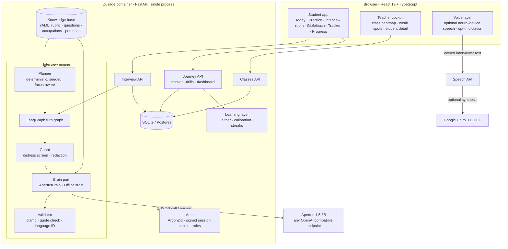
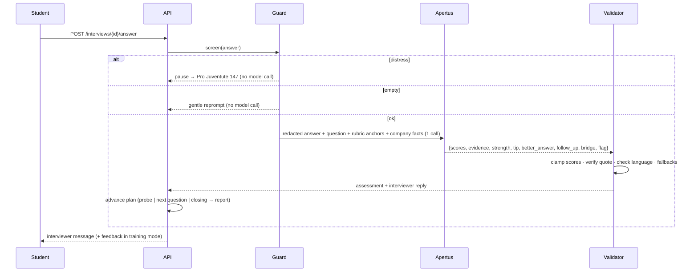

# Architecture

## Components

## One answer, step by step

## Key design decisions

| Decision | Why |
|---|---|
| **Single structured call per answer** | Coach and interviewer reason over the same evidence (no contradictions); ~1.1 calls/answer vs. the FHGR gate of 5; fewer requests than separate interviewer and assessor calls. |
| **Deterministic planner** | Questions are pre-written and reviewed in 5 languages → no language drift, no off-topic questions, no illegal questions. The model adapts *within* the skeleton (follow-ups, reactions). |
| **Planner variation + focus** | Seeded alternatives per slot (variation across sessions) and preference for questions that train the student's two weakest criteria (adaptive practice). |
| **Validator as a gate** | Clamps scores, requires the evidence quote to occur in the answer, rejects wrong-language text, falls back to hand-written phrases. Reduces specific failure modes; educator evaluation is still needed. |
| **Graceful degradation** | If Apertus fails, the turn is assessed by the offline coach and flagged `degraded`; the interview never breaks. |
| **State = one JSON document** | Engine is stateless; any worker continues any interview; the same state runs inside LangGraph/Aegra. |
| **Two LangGraph graphs, one implementation** | `turn_graph` (one invocation per answer, app-managed persistence) for the web app; `interview_graph` (interrupt-driven) for Aegra / LangGraph Server. Both call the same `core.py` functions. |
| **Offline brain = baseline** | The rule-based coach keeps the product and CI credential-free *and* serves as the baseline in the evaluation harness. |
| **Cookie sessions + Bearer** | HttpOnly cookie for browsers (no tokens in JS); the same JWT as Bearer for automated judges/harnesses. |
| **Self-hosted fonts, no CDN** | No font CDN dependency. Local inference and device speech support an isolated setup; hosted inference, optional neural speech, posting retrieval and push use external services. |

## Data model

| Table | Purpose |
|---|---|
| `user` | username (no e-mail needed), Argon2id hash, role, UI language, class, consent flag |
| `classroom` | teacher, 6-letter join code (no ambiguous characters) |
| `studentprofile` | age, school, hobbies, Schnupperlehre experience, story bank, target occupation |
| `application` | Lehrstellen tracker card with status history, interview date, job ad |
| `interview` | full engine state (JSON), report, confidence before/after, usage metrics |
| `drill` | Leitner card: question, box 1–5, due date, last/best score |

## Interfaces

- REST API - OpenAPI docs at `/docs`.
- `zusage selfcheck --url …` - end-to-end smoke test over HTTP (used by `make run`).
- `zusage simulate …` - scripted interview in the terminal.
- `zusage eval …` - evaluation harness.
- Aegra - `aegra.json` → `src/backend/aegra_graph.py:graph` (assistant id `zusage_interview`).
