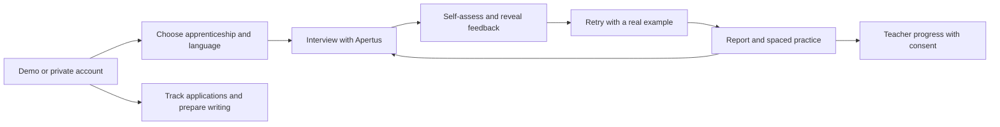
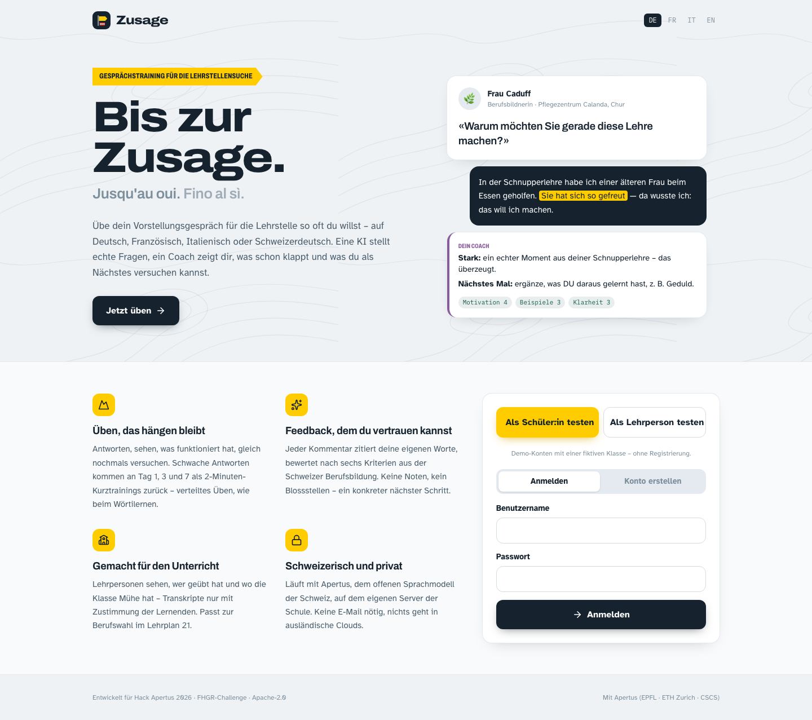
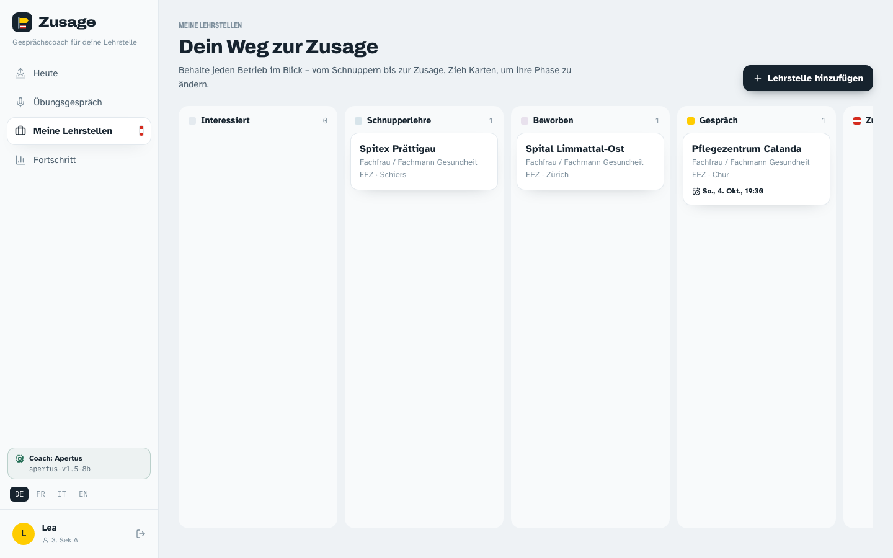
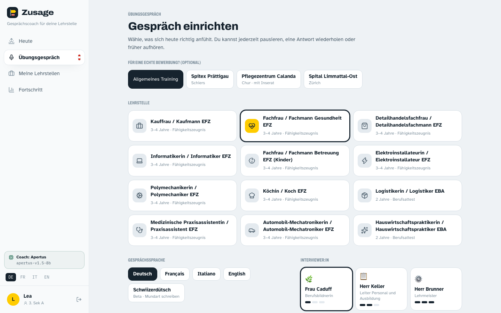
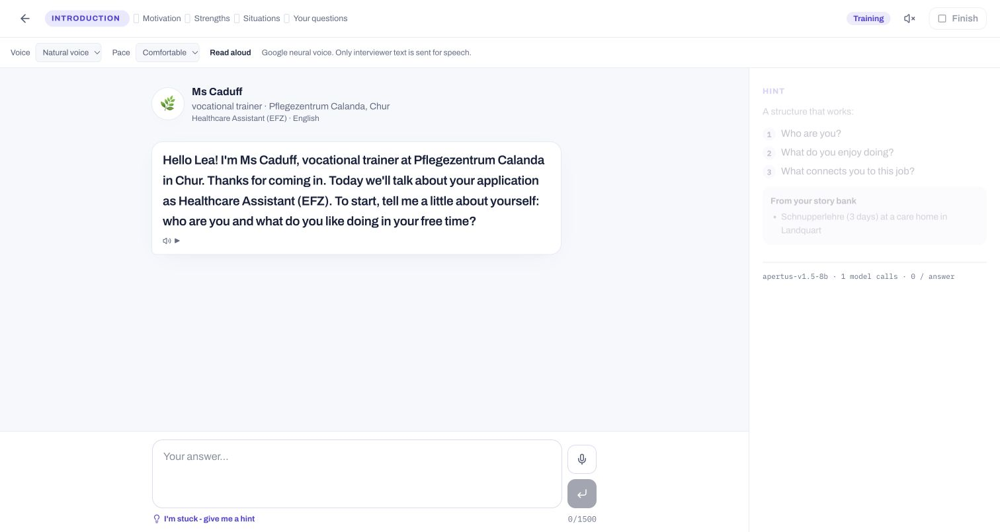
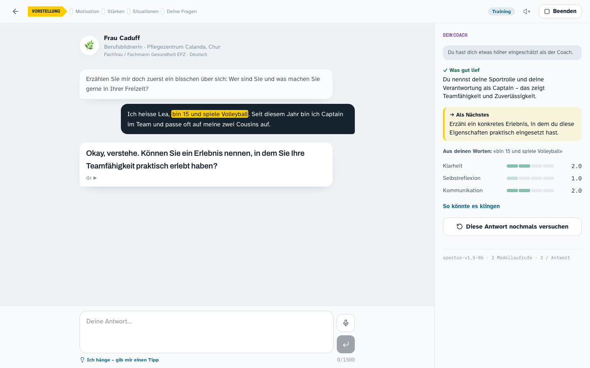
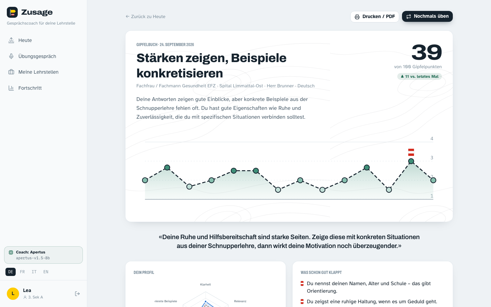
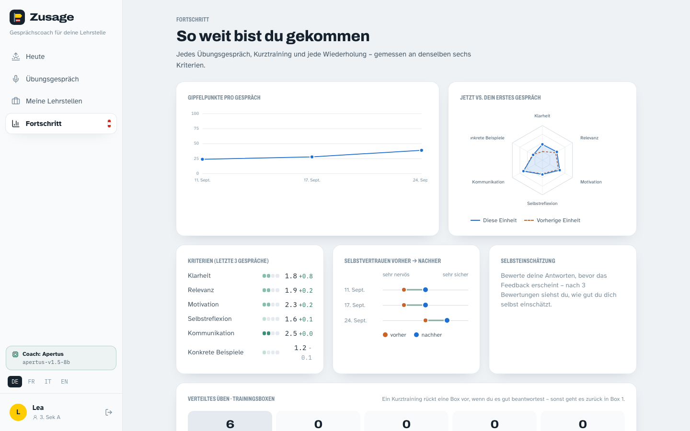
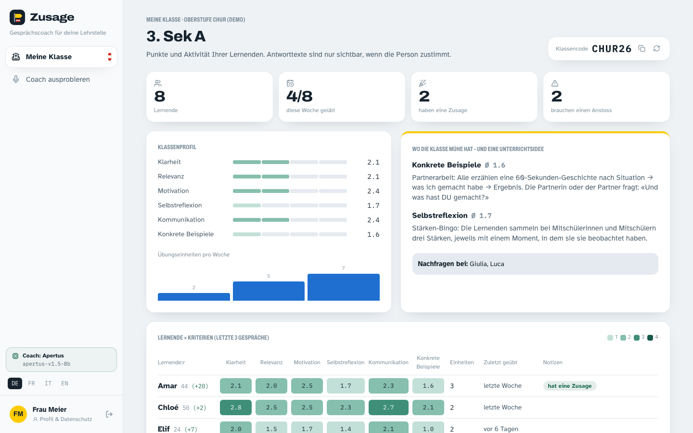
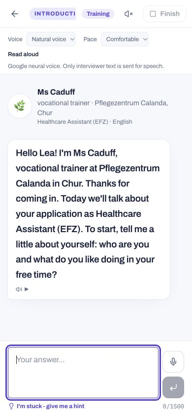

# Zusage functionality overview

[Live app](https://zusage.web.app) · [Submission video with captions](https://youtu.be/kNNu796CueY) · [Extended walkthrough](https://youtu.be/jgWSAaASskg)

## Learner journey

## Start and prepare

English is the default interface, with German, French and Italian options. Demo accounts let judges explore immediately. Learners track an opportunity and choose a tailored practice session.

## Practise and improve

Apertus reacts to the learner's answer and provides evidence-based feedback. Training mode supports self-assessment and retries; dress rehearsal holds feedback until the end. The optional neural voice offers pacing, replay and stop controls.

## Continue learning and teaching

Progress and drills make practice repeatable. Teachers see class-level progress; answer text requires explicit student consent. The layout adapts to a phone screen.

Screenshots show fictional demonstration accounts. Older screenshots record the submission build; voice screenshots show the subsequent speech improvement. See [architecture](ARCHITECTURE.md), [test steps](TESTING.md) and [privacy](PRIVACY.md).
